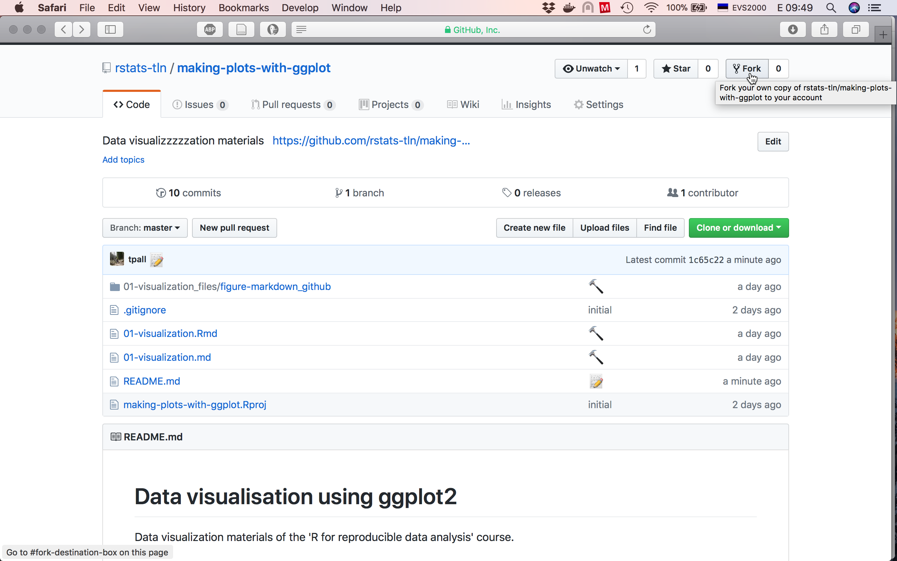
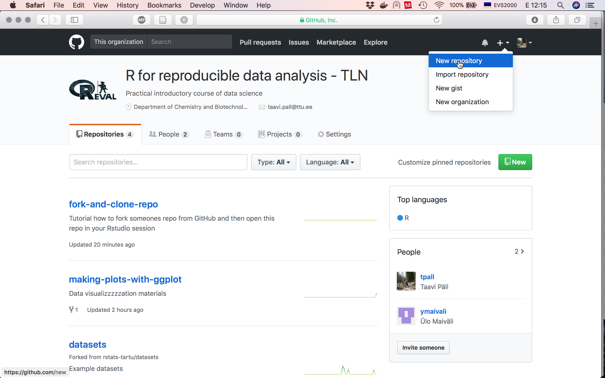
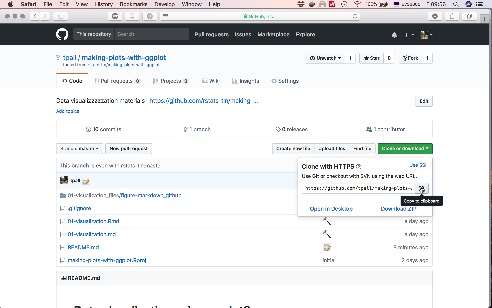
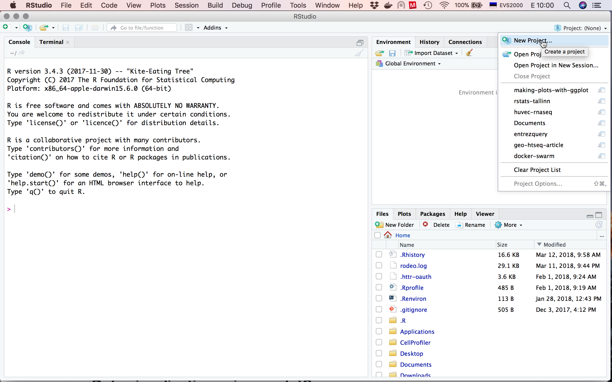
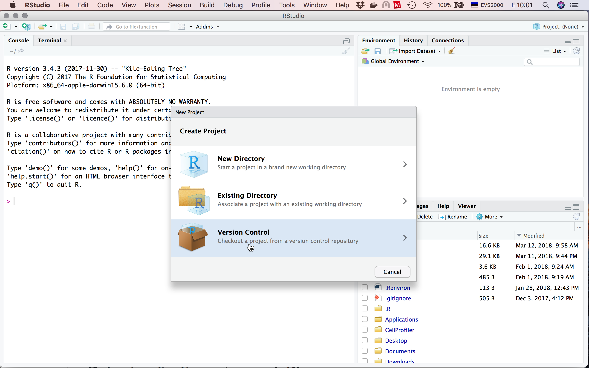
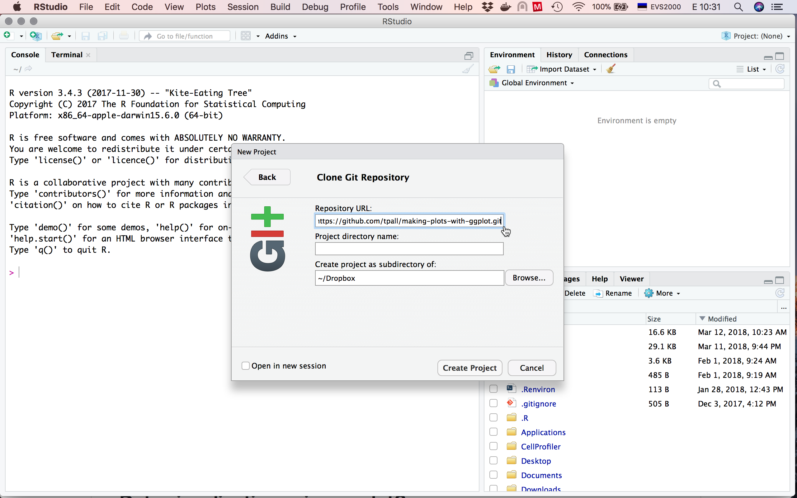
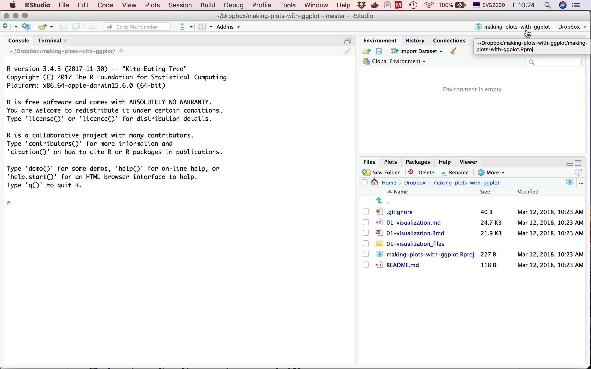
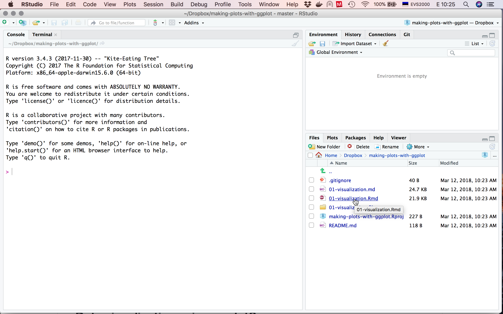
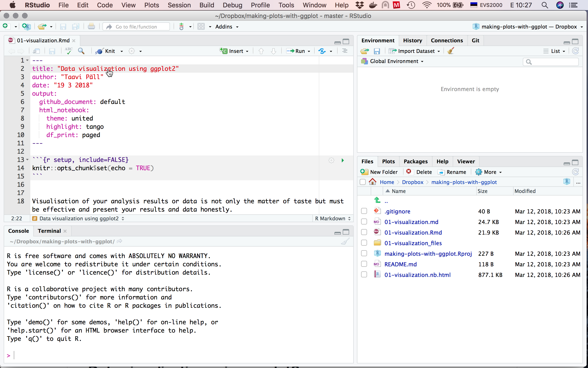

# Fork and clone repo to RStudio

Found an interesting R project on GitHub and want to collaborate, contribute, or play around with it but you don't know how to get this thing into your computer?

## Introduction
This tutorial describes steps how to **fork** repo from GitHub (step 1, optional) and how to **clone** (steps 2+) and open repo in your RStudio.

Excellent source to learn how to use git and GitHub for **begginners** with more use cases and **troubleshooting** is available at http://happygitwithr.com by Jenny Bryan. 

Please also have a look at the ["Why.." chapters](http://happygitwithr.com/big-picture.html#why-git), because it's definitely big question that might arise in one's head. 
Do I really need to make my life unnecessary complicated with all this version control stuff and command line? 

Using version control and uploading your work to repo hosting services like GitHub, Bitbucket, and GitLab allows you to:
- share, collaborate, and disseminate your work and makes you visible: you can publish a blog and even a book via Github pages! 
- transparent version control and your code is safe if you screw up your project locally

## Prerequsites
Tutorial assumes that you have R and RStudio installed to your computer, or you have [RStudio Cloud](https://rstudio.cloud) account. Then you need to have [GitHub account](http://happygitwithr.com/github-acct.html) and [git installed to your computer](http://happygitwithr.com/install-git.html) and you must [introduce yourself to git](http://happygitwithr.com/hello-git.html).


## Steps
You can start with repo that is already present on GitHub

1. Fork your repo of interest or create a new empty repo.

      (A) To fork a repo, click on the **Fork** button located in upper right corner of the repo page. GitHub starts process of copying this repo to your account.


      (B) To create a new repo, find a plus sign :heavy_plus_sign: on your GitHub account page upper right corner :arrow_upper_right: between a bell :bell: and your avatar :squirrel:. Fill in all necessary fields in tha new repo creation dialogue and also check :heavy_check_mark: "Initialize this repository with a README" option. This will create your repo with readme file, where you can describe what this repo is about and how to use this repo. Consider repo name carefully.


2. Clone repo to your computer. 

  - In your new repo click on the green "clone or download" button. Choose "use HTTPS" (or SSH if you have set it up) and click on the clipboard icon :clipboard: next to url to copy repo web address.
  

  - Open Rstudio and from the upper right corner "Project" menu start "New Project":
  
  
  - Start new project with "Version Control":
  
  
  - Paste your repo web URL (that you copied from GitHub) into "Repository URL" field, browse and choose where do you want your project folder to live (even Downloads folder is ok) and click "Create Project":
  
  
  - Your project is ready for your input:
  
  
3. To open file, click on the file name in the "File" pane or open file via File dialogue.
  

4. Start editing .Rmd file. 
  
  
There you go! Do some work, commit it with [good informative message](https://chris.beams.io/posts/git-commit/) and push your changes to GitHub.

...and there are even more [resources](https://maraaverick.rbind.io/2017/12/git-guides/)


### Increasing the lifetime of your credentials
When interacting with GitHub over https (as in our classes), it is possible to increase the lifetime of your credentials to 1 hour and save some username and password retyping by using the following command:

```
git config --global credential.helper 'cache --timeout=3600'
```


